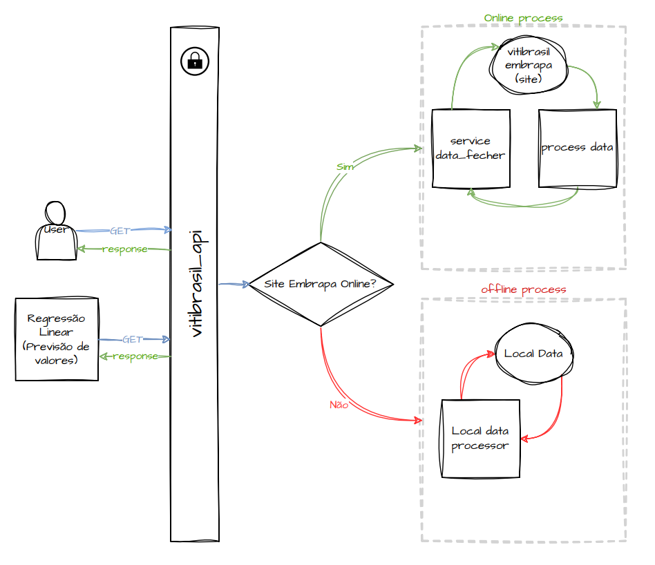

# API_VITBRASIL

Tech Challenge: API Vitibrasil

# Menu

- [Alunos](#alunos)
- [Objetivo do Projeto](#objetivo-do-projeto)
- [Como Rodar o Projeto Localmente](#como-rodar-o-projeto-localmente)
  - [Clone o repositório e execute o build](#clone-o-repositório-e-execute-o-build)
  - [Acessando a API e a Documentação](#acessando-a-api-e-a-documentação)
  - [Acesso Temporário](#acesso-temporário)
- [Arquitetura da API](#arquitetura-da-api)
  - [Autenticação](#autenticação)
  - [Consumo de Dados e Redundância](#consumo-de-dados-e-redundância)
  - [Atualização de Dados em CSV](#atualização-de-dados-em-csv)
  - [Fluxo Resumido](#fluxo-resumido)
- [Deploy](#deploy)
- [Etapas do Fluxo de Deploy](#etapas-do-fluxo-de-deploy)
  - [1. Push do Código para o GitHub](#1-push-do-código-para-o-github)
  - [2. GitHub Actions e o Processo de Build](#2-github-actions-e-o-processo-de-build)
  - [3. Deploy para o Cloud Run](#3-deploy-para-o-cloud-run)
  - [Benefícios do Processo de Deploy Automatizado](#benefícios-do-processo-de-deploy-automatizado)
- [Documentação dos Testes para as Rotas da API `api_vitibrasil`](#documentação-dos-testes-para-as-rotas-da-api-api_vitibrasil)
- [Descrição dos Testes](#descrição-dos-testes)
  - [`test_routes`](#test_routes)
  - [`test_routes_fallback_to_csv`](#test_routes_fallback_to_csv)
- [Benefícios dos Testes](#benefícios-dos-testes)

## Alunos

Este projeto foi desenvolvido pelos alunos:

- **Lucas Araujo** (RM358757)
- **Lucas Martins** (RM358914)

Ambos trabalharam de forma colaborativa para criar uma solução robusta e bem documentada, ideal para demonstração de conceitos acadêmicos e práticas de desenvolvimento de APIs que foi solicitado no Tech Challenge FIAP.

## Objetivo do Projeto

Desenvolver uma REST API em Python que consulte dados do site da [Embrapa](http://vitibrasil.cnpuv.embrapa.br/), documentada e com autenticação básica para fins acadêmicos. O projeto inclui um plano de arquitetura para o deploy, garantindo disponibilidade e atualização contínua dos dados, e está acessível em um MVP compartilhável no GitHub. A API foi desenhada para ser utilizada em cenários onde a atualização e acessibilidade dos dados são essenciais, com potencial de expansão para aplicações em análises mais avançadas.

## Como Rodar o Projeto Localmente

Para rodar este projeto localmente, siga as instruções abaixo:

### **Clone o repositório e execute o build**:

```bash
git clone https://github.com/Lucasas001/api_vitibrasil.git
cd api_vitibrasil
bash build_and_run.sh
```

### Acessando a API e a Documentação

- Após executar o script, a API estará disponível localmente em: [http://127.0.0.1:8080](http://127.0.0.1:8080)
- A documentação interativa da API pode ser acessada em: [http://127.0.0.1:8080/docs](http://127.0.0.1:8080/docs)

> Autenticação Básica: Para realizar requisições nos endpoints, utilize.
>
> - **Usuário**: `fiap`
> - **Senha**: `FIAP123`

Essas etapas permitem que você rode o projeto localmente, explore os endpoints e teste as funcionalidades conforme necessário...

### Acesso Temporário

A API está publicada no **Cloud Run** para avaliação deste desafio e pode ser acessada temporariamente através do seguinte link: [https://api-vitibrasil-728626604116.us-central1.run.app](https://api-vitibrasil-728626604116.us-central1.run.app).
Acessa a documentação no link: [docs](https://api-vitibrasil-728626604116.us-central1.run.app/docs)

> **Obs.:** Por se tratar de uma implementação com finalidade acadêmica, limitamos os recursos dos servidores para evitar consumo excessivo de dados e custos desnecessários. Portanto, o uso deste link pode apresentar lentidões/indisponibilidade devido a essas restrições.

## Arquitetura da API



Nossa API foi desenvolvida usando **FastAPI**, um framework moderno e performático para construção de APIs. Abaixo estão os principais motivos para a escolha do FastAPI:

- **Performance**: Baseada em ASGI e utilizando AsyncIO do Python, o que torna o FastAPI altamente eficiente, ideal para aplicações que exigem respostas rápidas.
- **Documentação Automática**: FastAPI gera uma documentação interativa e intuitiva (usando Swagger UI e ReDoc), facilitando o uso e entendimento da API para desenvolvedores. A documentação automática permite interações práticas, facilitando o teste e entendimento das rotas.

### Estrutura do projeto

```
├── api_vitibrasil                    # Diretório raiz do projeto 'api_vitibrasil'.
│   ├── api                           # Pasta principal da API e definição de rotas.
│   │   ├── __init__.py
│   │   └── v1                        # Diretório da versão 1 da API para gerenciamento de rotas.
│   │       ├── __init__.py
│   │       └── routes.py             # Define as rotas da API e tratamento de requisições.
│   ├── csv                           # Pasta para armazenar arquivos CSV brutos e processados.
│   │   ├── csv_raw                   # Diretório para arquivos CSV brutos baixados.
│   │       └── ********.csv
│   │   └── csv_refined               # Diretório para arquivos CSV refinados/processados.
│   │       └── ********.csv
│   ├── __init__.py
│   ├── main.py                       # Ponto de entrada para executar a aplicação.
│   ├── modules                       # Pasta contendo módulos para tarefas de processamento.
│   │   ├── csv_downloader.py         # Módulo para baixar arquivos CSV.
│   │   └── csv_processor.py          # Módulo para processar e refinar arquivos CSV.
│   ├── services                      # Pasta para módulos de serviço relacionados a operações de dados.
│   │   ├── data_fetcher_ie.py        # Módulo para buscar dados com lógica Importação e Exportação.
│   │   ├── data_fetcher.py           # Módulo para buscar dados com lógica generica.
│   │   ├── data_read.py              # Módulo para ler os CSV.
│   │   └── verify_credentials.py     # Módulo para verificar credenciais de acesso da API.
│   └── start.py                      # Script para iniciar a aplicação e configurar os serviços.
├── build_and_run.sh                  # Script para construir e executar o contêiner Docker.
├── crontab                           # Arquivo de configuração do cron para agendar tarefas.
├── Dockerfile                        # Dockerfile para construir a imagem Docker.
├── entrypoint.sh                     # Script de entrada para inicialização do contêiner Docker.
├── images                            # Pasta para armazenar imagens relacionadas ao projeto.
│   ├── api_fluxo.png
│   └── DEPLOY.jpg
├── poetry.lock                       # Arquivo para o gerenciador de pacotes Poetry.
├── pyproject.toml                    # Arquivo de configuração do projeto para o Poetry.
├── README.md
└── tests                             # Pasta para scripts de teste.
    ├── __init__.py
    └── test.py                       # Contém casos de teste para validação de funcionalidades.

```

### Autenticação

Como o projeto é voltado para fins acadêmicos, implementamos uma camada de **Autenticação HTTP Básica**. Essa autenticação foi incluída para demonstrar como uma camada de segurança pode funcionar em uma API. Em ambientes de produção, seria recomendável usar métodos mais seguros, como OAuth2 ou autenticação baseada em token (JWT).

### Consumo de Dados e Redundância

A API foi projetada para consumir dados através de **web scraping**, coletando informações do site [http://vitibrasil.cnpuv.embrapa.br/](http://vitibrasil.cnpuv.embrapa.br/). Para garantir a resiliência e a disponibilidade das informações, a arquitetura inclui uma estratégia de redundância:

1. **Requisições ao Site**: A API tenta coletar dados diretamente do site sempre que é chamada, com uma tolerância de falhas. Se o site estiver offline ou a API falhar três vezes consecutivas ao tentar acessá-lo, um sistema de fallback é ativado.

2. **Fallback com Dados CSV Pré-Carregados**: Se o site estiver indisponível, a API usa dados armazenados localmente em arquivos **CSV**. Esses arquivos CSV são pré-carregados, garantindo que a API possa responder com dados atualizados mesmo quando o site-fonte está offline.

### Atualização de Dados em CSV

Para manter os dados locais atualizados, a arquitetura inclui um processo de atualização periódica dos arquivos CSV:

- **Carga Inicial e Atualização Automática**: Durante a inicialização da API, os arquivos CSV são carregados, garantindo que informações estejam disponíveis desde o início.
- **Agendamento de Atualizações**: Um processo é executado automaticamente a cada 1 hora para verificar se o site-fonte disponibilizou novos dados. Se o site estiver online, a API baixa e substitui os arquivos CSV antigos, mantendo as informações o mais atualizadas possível.

Esse fluxo proporciona uma arquitetura robusta, onde os dados são mantidos localmente e atualizados regularmente, permitindo que a API funcione independentemente da disponibilidade do site-fonte.

### Fluxo Resumido

1. **Cliente** faz uma requisição para uma rota da API.
2. **API** tenta coletar dados do site via web scraping.
3. Se o **site estiver offline ou ocorrerem 3 falhas**, a API retorna dados dos arquivos CSV locais.
4. **Processo de atualização** verifica o site a cada 1 hora para substituir ou atualizar os csv.

# Deploy

Desenho do processo de Deploy:


Para explicar o processo de **Deploy** de maneira detalhada, aqui está um resumo do que cada ferramenta e etapa faz:

- Usamos uma combinação de **GitHub**, **Artifact Registry**, e **Cloud Run** para criar um processo de deploy automatizado e confiável. Esse processo facilita o fluxo de trabalho dos desenvolvedores e permite a atualização contínua da API em produção com cada novo push na branch main.

Etapas do Fluxo de Deploy

### 1. **Push do Código para o GitHub:**

- O processo de deploy começa quando os desenvolvedores fazem o push do código para o repositório no GitHub.
- Qualquer mudança na branch principal `(main)` aciona automaticamente o processo de build, configurado no GitHub Actions.

### 2. GitHub Actions e o Processo de Build:

- O **GitHub Actions** identifica a nova atualização no repositório e executa o nosso [workflow de build](.github/workflows/build.yml).

- Esse workflow é composto de várias etapas essenciais para garantir que o código seja atualizado de forma segura e eficiente. De forma resumida, executa

  - **Autenticação com o GCP:** O GitHub Actions autentica com o ambiente do Google Cloud Platform (GCP), usando credenciais seguras, para garantir que o processo de build e deploy tenha permissão de acessar o Artifact Registry e o Cloud Run.

  - **Build da Imagem Docker:** Com a autenticação concluída, o GitHub Actions inicia o processo de criação da imagem Docker. A imagem Docker contém a API, empacotado com todas as dependências e configurações.

  - **Push da Imagem para o Artifact Registry:** Após o build da imagem, ela é enviada para o Artifact Registry no GCP. O Artifact Registry atua como um repositório seguro para armazenar e versionar as imagens Docker. Cada versão da imagem corresponde a uma versão do aplicativo.

### 3. **Deploy para o Cloud Run:**

- Com a imagem Docker armazenada no Artifact Registry, o GitHub Actions inicia o processo de deploy no **Cloud Run**.
- O **Cloud Run** é um serviço gerenciado do GCP que permite executar contêineres de forma escalável. Assim, o aplicativo é configurado para ser executado em um ambiente seguro e escalável, onde pode responder às solicitações da API.
- Toda vez que um novo build é concluído e um push na branch `main` é detectado, o workflow atualiza automaticamente o aplicativo no Cloud Run, garantindo que a última versão do código esteja sempre em produção.

### **Benefícios do Processo de Deploy Automatizado**

- **Automação Completa:** Não é necessário intervenção manual em cada etapa do deploy, o que reduz erros e agiliza a atualização da API.
- **Controle de Versão:** Cada versão do aplicativo está armazenada no Artifact Registry, o que facilita o rastreamento e rollback em caso de problemas.
- **Escalabilidade e Confiabilidade com o Cloud Run:** O Cloud Run gerencia a escalabilidade do aplicativo, ajustando automaticamente os recursos conforme o tráfego aumenta ou diminui.

Esse fluxo permite um desenvolvimento contínuo e uma entrega rápida de novas funcionalidades e correções na API, mantendo o ambiente de produção sempre atualizado e estável.

# Documentação dos Testes para as Rotas da API `api_vitibrasil`

Este conjunto de testes automatizados verifica o comportamento das principais rotas da API `api_vitibrasil`, que abrangem dados de produção, processamento, importação e exportação de uvas e vinhos.

## Descrição dos Testes

### `test_routes`

- **Descrição**: Este teste percorre todas as rotas principais da API, simulando uma resposta bem-sucedida com dados para verificar a estrutura e o conteúdo da resposta.
- **Objetivo**: Assegurar que todas as rotas da API respondem com o código `200 OK` e que a resposta possui a chave `"data"` contendo uma lista, indicando que os dados foram carregados corretamente.

### `test_routes_fallback_to_csv`

- **Descrição**: Testa o mecanismo de fallback de cada rota. Quando a API externa falha (retorna `500`), a API `api_vitibrasil` deve utilizar um arquivo CSV local como fonte de dados.
- **Objetivo**: Garantir que o sistema é resiliente, respondendo com `200 OK` e a estrutura correta mesmo em caso de falha na conexão com a API externa.

## Benefícios dos Testes

- **Confiabilidade**: Ao verificar todas as rotas principais, os testes garantem que a API está funcionando conforme o esperado e retornando dados consistentes.
- **Resiliência**: O teste de fallback para CSV confirma que, em caso de falha da API externa, o sistema ainda consegue fornecer dados, evitando interrupções no serviço.
- **Segurança e Controle de Acesso**: Cada requisição inclui autenticação básica, garantindo que apenas usuários autorizados podem acessar os dados.
- **Facilidade de Manutenção**: Ao automatizar os testes para todas as rotas, os desenvolvedores podem rapidamente validar alterações ou atualizações na API sem a necessidade de testes manuais extensivos.

Estes testes cobrem os fluxos principais e reforçam a estabilidade e segurança da API `api_vitibrasil`, garantindo a continuidade do serviço em diferentes condições.
